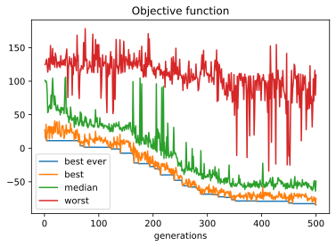

# Bipedal Walker trained with CMA-ES

This is a project I'm currently working on.

A feed-forward neural network is trained to pilot a [Bipedal Walker](https://gym.openai.com/envs/BipedalWalker-v2/) (one of OpenAI Gym environments) using a [CMA Evolutionary Strategy](https://en.wikipedia.org/wiki/CMA-ES) (using [pycma](https://github.com/CMA-ES/pycma) package). 

## Setup

- Install Gym (and the box2 environments) from source:
```
git clone https://github.com/openai/gym
cd gym
pip install -e .[box2d]
```

- Install the rest of the required packages (including ```torch``` and ```pycma```):

```
pip install -r ./Gym_Walker_CMA-ES/requirements.txt
```

## Usage

Use ```run_training.py``` to train and save the model.
```
$ python ./Gym_Walker_CMA-ES/run_training.py -h
usage: run_training.py [-h] [--duration DURATION] [--n_gens N_GENS]
                       [--std STD] [--file FILE] [--no_multiproc] [--logging]

Train model with cma-es

optional arguments:
  -h, --help           show this help message and exit
  --duration DURATION  duration of episode
  --n_gens N_GENS      n of generations
  --std STD            starting std
  --file FILE          file to save model
  --no_multiproc       disable multiprocessing
  --logging            enable cma logging
```

Use ```test.py``` to see the model in action.
```
$ python ./Gym_Walker_CMA-ES/test.py -h
usage: test.py [-h] [--duration DURATION] model_file

Test model

positional arguments:
  model_file           file to load as model

optional arguments:
  -h, --help           show this help message and exit
  --duration DURATION  duration of episode
```

## Plotting the training

The `pycma` library presents its own functionality to plot the data logged in the `/outcmaes` directory.
However, since they don't seem to be currently working, I have made my own plotting in the `plot_cmaes.ipynb` jupyter notebook. The output is shown below.

```
Plotting training statistics.
```


